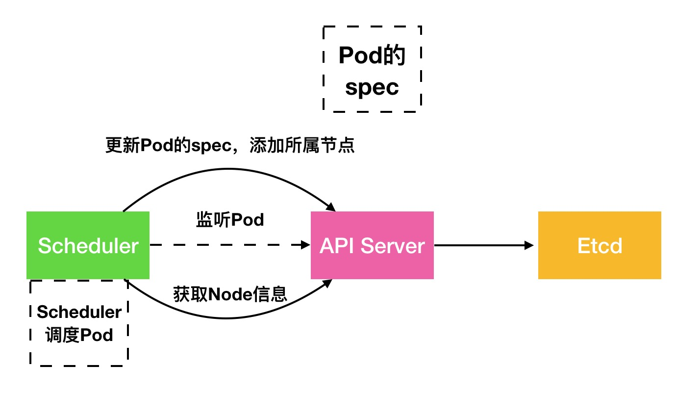

# Head First k8s

## 1. 进入k8s的世界

>k8s是什么

&ensp;&ensp;&ensp;&ensp;k8s是kubernetes的缩写，取其首尾字母，和中间的8个英文字母。说起k8s的前身，不得不提到大名鼎鼎的Google。kubernetes来源于Google内部使用的Borg系统，Google于2014年6月基于Borg将其作为初始和核心项目贡献给 CNCF（云原生计算基金会），才演变为了今天的kubernetes。

&ensp;&ensp;&ensp;&ensp;kubernetes这个单词是希腊语，它的中文翻译是舵手，正如它的命名一样，k8s的职责就是为大型邮轮指引方向，大型的邮轮就是我们一个个集群，每个邮轮上放着许多的集装箱（contianer）。


>docker和k8s

&ensp;&ensp;&ensp;&ensp;了解过docker的同学肯定会问docker不是已经已经做了虚拟化了吗，我们为什么还需要k8s呢。

&ensp;&ensp;&ensp;&ensp;我们先回顾下docker的核心，docker设计的核心目标目标是build、skip、run，即构建、传输和运行，这三点也是docker镜像和docker容器的核心能力。
那k8s的核心功能和关注点和docker有什么不同呢？

## k8s的核心功能

&ensp;&ensp;&ensp;&ensp;k8s的设计参考了12factor，设计了基于声明式API来管理容器的运行和关系，所有的操作都可以通过API来操作，所以我们也称k8s为容器编排引擎。相比于docker的关注点，k8s专注于容器运行时的生命周期管理，而且k8s不只关注单一容器的运行状态，k8s关注于容器组的调度管理，容器之间的关系。

&ensp;&ensp;&ensp;&ensp;kubernetes有如下几个核心功能：

- 故障自愈: 重新启动失败的容器，在节点不可用时，替换和重新调度节点上的容器，对用户定义的健康检查不响应的容器会被中止，并且在容器准备好服务之前不会把其向客户端广播。
- 弹性伸缩: 通过监控容器的cpu的负载值,如果这个平均高于80%,增加容器的数量,如果这个平均低于10%,减少容器的数量
- 服务的自动发现和负载均衡: 不需要修改您的应用程序来使用不熟悉的服务发现机制，Kubernetes 为容器提供了自己的 IP 地址和一组容器的单个 DNS 名称，并可以在它们之间进行负载均衡。
- 滚动升级和一键回滚: Kubernetes 逐渐部署对应用程序或其配置的更改，同时监视应用程序运行状况，以确保它不会同时终止所有实例。 如果出现问题，Kubernetes会为您恢复更改，利用日益增长的部署解决方案的生态系统。

>故障自愈

&ensp;&ensp;&ensp;&ensp;k8s提供了应用的故障检查和故障自愈的能力，主要的故障有两种：

- 应用故障：

&ensp;&ensp;&ensp;&ensp;应用故障是由于代码的bug或者应用的负载超过了配置的自愈，导致的应用不可用，k8s通过预先声明的应用健康检查接口（tcp，http，命令行）来监听应用，如果发现应用故障，则会尝试重新启动来恢复。


- 节点故障：

&ensp;&ensp;&ensp;&ensp;节点故障是由于运行的物理机故障导致的应用不可用，k8s会监听节点的健康状态，如果应用故障，会迁移应用到其他存活节点：


>弹性扩缩容

&ensp;&ensp;&ensp;&ensp;k8s有检查应用负载的能力，在检查到项目负载过大的情况下，可以设置自动，或者手动来扩容节点，从而达到应对瞬时高负载的业务情况：


>服务发现和负载均衡

&ensp;&ensp;&ensp;&ensp;之前提到了k8s的应用可以故障自愈和弹性扩缩容，容器所在的节点和ip也是变化的，这种变化对于调用方来说是不可接受的，于是k8s声明了服务资源，来解决这个问题，k8s会监听服务资源和应用资源，将所有访问服务资源的api请求转发到应用，在应用扩容和重新启动后，k8s也会更新服务资源的请求：


>滚动升级

&ensp;&ensp;&ensp;&ensp;k8s设计了滚动升级和回滚的流程，k8s在升级时会按照比例启动至少一个新的应用节点，如果升级后应用无法启动则会暴露升级前的应用，并持续提供服务，当升级后应用成功启动并通过健康检查后才会删除升级前的应用，同时切换服务：

- 应用升级成功：

- 应用升级失败：


## k8s的核心概念

&ensp;&ensp;&ensp;&ensp;上一节介绍了k8s的核心功能，那么这些功能是怎么实现的呢，接下来我们介绍下k8s的核心概念，上一节提到的这些能力都是通过下面的k8s资源承载的。

>Pod

&ensp;&ensp;&ensp;&ensp;什么是Pod呢？Pod 是可以在 Kubernetes 中创建和管理的、最小的可部署的计算单元。一个Pod是一个可运行应用节点的最小抽象，每个Pod包含来多个container，它们共享存储和网络，一起提供一组服务，即Pod是一组container的集合。

&ensp;&ensp;&ensp;&ensp;下图就描述了一个Pod是如何提供服务的，下图描述了一个应用节点，该应用包含两个container，一个container作为web server提供restful服务，一个contiiner作为file puller与内容服务获取信息，更新服务内容。两个应用部署开发各自独立，运行时共享网络和存储，file puller更新数据，web server读取数据提供服务。


&ensp;&ensp;&ensp;&ensp;那我们一般如何创建一个Pod呢。我们一般使用Pod模版来创建Pod，Pod模板是包含在工作负载对象中的规范，负载资源包括 Deployment、Job和 DaemonSets等。工作负载的控制器会使用负载对象中的PodTemplate 来生成实际的Pod。PodTemplate是你用来运行应用时指定的负载资源的目标状态的一部分。

&ensp;&ensp;&ensp;&ensp;下面的示例是一个简单的Job的清单，其中的template指示启动一个容器。该Pod中的容器会打印一条消息之后暂停。

```yaml
apiVersion: batch/v1
kind: Job
metadata:
  name: hello
spec:
  template:
    # 这里是 Pod 模版
    spec:
      containers:
      - name: hello
        image: busybox
        command: ['sh', '-c', 'echo "Hello, Kubernetes!" && sleep 3600']
      restartPolicy: OnFailure
    # 以上为 Pod 模版
```

>Volume

&ensp;&ensp;&ensp;&ensp;容器中的文件在磁盘上是临时存放的，这给容器中运行的特殊应用程序带来一些问题。首先，当容器崩溃时，kubelet 将重新启动容器，容器中的文件将会丢失——因为容器会以干净的状态重建。 其次，当在一个 Pod 中同时运行多个容器时，常常需要在这些容器之间共享文件。Kubernetes抽象出Volume对象来解决这两个问题。k8s支持以下类型的Volume：

- awsElasticBlockStore
- azureDisk
- azureFile
- cephfs
- cinder
- configMap
- csi
- downwardAPI
- emptyDir
- fc (fibre channel)
- flexVolume
- flocker
- gcePersistentDisk
- gitRepo (deprecated)
- glusterfs
- hostPath
- iscsi
- local
- nfs
- persistentVolumeClaim
- projected
- portworxVolume
- quobyte
- rbd
- scaleIO
- secret
- storageos
- vsphereVolume

&ensp;&ensp;&ensp;&ensp;其中使用最多的存储卷资源是persistentVolumeClaim，我们以persistentVolumeClaim为例子，来介绍下k8s是如何在Pod中注入持久化存储。表达的是用户对存储的请求，概念上与Pod类似，Pod会消耗节点的cpu，memory资源，PVC会消耗PV资源。然后可以在PVC里设置申领PV的大小和访问模式。

&ensp;&ensp;&ensp;&ensp;持久卷（PersistentVolume，PV）其实就是集群中一块存储的抽象，可以由管理员事先供应也可以通过storageClass动态供应，PV使用k8s卷插件来实现，实现来统一的存储接口，来屏蔽后端存储的类型（NFS，ISCSI，特定的存储CSI抽象）。


&ensp;&ensp;&ensp;&ensp;下面是一个存储使用的例子，我们声明了一个PV来获取nfs的存储资源，然后声明来一个PVC来和Pod绑定，从而提供了持久化的存储：

- volume.yaml

```yaml
apiVersion: v1
kind: PersistentVolume
metadata:
  name: pv0003
  labels:
    release: "stable"
spec:
  capacity:
    storage: 5Gi
  volumeMode: Filesystem
  accessModes:
    - ReadWriteOnce
  persistentVolumeReclaimPolicy: Recycle
  storageClassName: slow
  mountOptions:
    - hard
    - nfsvers=4.1
  nfs:
    path: /tmp
    server: 172.17.0.2
---
apiVersion: v1
kind: PersistentVolumeClaim
metadata:
  name: myclaim
spec:
  accessModes:
    - ReadWriteOnce
  volumeMode: Filesystem
  resources:
    requests:
      storage: 8Gi
  storageClassName: slow
  selector:
    matchLabels:
      release: "stable"
    matchExpressions:
      - {key: environment, operator: In, values: [dev]}
---
apiVersion: v1
kind: Pod
metadata:
  name: mypod
spec:
  containers:
    - name: myfrontend
      image: nginx
      volumeMounts:
      - mountPath: "/var/www/html"
        name: mypd
  volumes:
    - name: mypd
      persistentVolumeClaim:
        claimName: myclaim
```

>Deployment

&ensp;&ensp;&ensp;&ensp;Pod是最基本的运行单元，那Deployment就是k8s中最常用的负载资源，是k8s中最常用部署管理镜像的资源对象。开发者负责描述Deployment中的目标状态，而Deployment控制器会监听Deployment资源，将其变为目标状态，包括PodTemplate，cpu，memory资源，volume资源等。


&ensp;&ensp;&ensp;&ensp;下面是一个Deployment的例子，我们声明了一个Deployment部署一个nginx应用，它的副本数是3：

- deployment.yaml:

```yaml
apiVersion: apps/v1
kind: Deployment
metadata:
  name: webapp1
spec:
  replicas: 3
  selector:
    matchLabels:
      app: webapp1
  template:
    metadata:
      labels:
        app: webapp1
    spec:
      containers:
      - name: webapp1
        image: nginx:1.7.9
        ports:
        - containerPort: 80
```

>Service

&ensp;&ensp;&ensp;&ensp;介绍了应用的部署和存储，接下来我们介绍下应用的负载均衡和服务发现的关键资源Service。Service 定义了这样一种抽象：逻辑上的一组Pod，有统一的可访问策略。通过这种策略这一组 Pod能够被Service访问到，外部应用就通过Service的地址来访问这一组Pod。Kubernetes进行服务发现和负载均衡则是在Service和Pod中增加来一种资源Endpoint，只要服务中的Pod集合发生更改，Endpoints就会被更新，k8s会监听整个集群的Endpoint资源和Service来转发流量。


&ensp;&ensp;&ensp;&ensp;Service资源可以设置关联的服务label，暴露的端口，还可以设置Service服务的类型，默认会创建ClusterIP类型的Service：

- ClusterIP：通过集群的内部 IP 暴露服务，选择该值时服务只能够在集群内部可以访问，这也是默认的 ServiceType。

- NodePort：通过每个 Node 上的 IP 和静态端口（NodePort）暴露服务。 NodePort 服务会路由到 ClusterIP 服务，这个 ClusterIP 服务会自动创建。 通过请求 <NodeIP>:<NodePort>，可以从集群的外部访问一个 NodePort 服务。

- LoadBalancer：使用云提供商的负载局衡器，可以向外部暴露服务。 外部的负载均衡器可以路由到 NodePort 服务和 ClusterIP 服务。

- ExternalName：通过返回 CNAME 和它的值，可以将服务映射到 externalName 字段的内容（例如， foo.bar.example.com）。该类型可以在引入外部服务的时候使用。

&ensp;&ensp;&ensp;&ensp;下面是一个Service的例子，我们声明了一个ClusterIP类型的Service指向之前的Deployment服务：

- service.yaml:

```yaml
apiVersion: v1
kind: Service
metadata:
  name: my-service
spec:
  type: ClusterIP
  selector:
    app: webapp1
  ports:
      # 默认情况下，为了方便起见，`targetPort` 被设置为与 `port` 字段相同的值。
    - port: 80
      targetPort: 80
```

>Namespace

&ensp;&ensp;&ensp;&ensp;Kubernetes 支持多个虚拟集群，它们底层依赖于同一个物理集群。 这些虚拟集群被称为Namepace。Namespace为名称提供了一个范围。资源的名称需要在Namespace内是唯一的，但不能跨Namespace。Namespace不能相互嵌套，每个 Kubernetes 资源只能在一个Namespace中。不同的Namespace的资源可以通过Quota资源来隔离，不同Namespace的访问策略可以通过NetworkPolicy来执行。

&ensp;&ensp;&ensp;&ensp;当你创建一个Service时， Kubernetes 会创建一个相应的 DNS 条目。该条目的形式是 <Service名称>.<Namespace名称>.svc.cluster.local，这意味着如果容器只使用 <Service名称>，它将被解析到本地名字空间的服务。这也是k8s中部署多个版本的相同应用的最佳实践，通过namespace隔离。

## k8s的架构

&ensp;&ensp;&ensp;&ensp;了解了k8s的核心概念后，我们简单介绍下k8s的架构，相信大家在了解了k8s的架构之后，会对k8s的核心概念是如何实现容器编排的能力有不一样的理解。

>整体架构

&ensp;&ensp;&ensp;&ensp;k8s是一个比较典型的server-client架构，每一个 Kubernetes 集群都由一组 Master 节点和一系列的 Worker 节点组成，其中 Master 节点主要负责存储集群的状态并为 Kubernetes 对象分配和调度资源。


&ensp;&ensp;&ensp;&ensp;Master节点主要负责接收客户端的请求，安排容器的执行并且运行控制循环，将集群的状态向目标状态进行迁移。

&ensp;&ensp;&ensp;&ensp;Node节点比较简单，它主要负责接受Master节点的请求，然后执行相应的操作。

>Master架构

&ensp;&ensp;&ensp;&ensp;k8s的master由以下四个组件组成：API server，ControllerManager，Scheduler，etcd：


- etcd是一个key value数据库，保存了整个集群的所有的持久化数据，包括k8s资源的状态和k8s集群的状态；
- apiserver提供了资源操作的唯一入口，并提供认证、授权、访问控制、API注册和发现等机制，是客户端访问的唯一入口；
- controller manager负责维护集群的状态，比如故障检测、自动扩展、滚动更新等；
- scheduler负责资源的调度，按照预定的调度策略将Pod调度到相应的Node机器上；

&ensp;&ensp;&ensp;&ensp;除了核心组件，还有一些推荐的插件部署可以在Master或者单独声明相应的管理节点，其中有的已经成为CNCF中的托管项目：

- CoreDNS负责为整个集群提供DNS服务；
- Ingress Controller为服务提供外网入口；
- Prometheus提供资源监控；
- Dashboard提供UI管理控制台；

>Node架构

&ensp;&ensp;&ensp;&ensp;k8s的node由 kubelet 和 kube-proxy 两部分组成，底层的Container Runtime提供负责镜像管理以及Pod和容器的真正运行（CRI），docker就是其中一种Container Runtime：


- kubelet负责维护容器的生命周期，同时也负责Volume（CSI）和网络（CNI）的管理；
- kube-proxy负责为Service提供cluster内部的服务发现和负载均衡；

>kubectl

&ensp;&ensp;&ensp;&ensp;kubectl 是 Kubernetes 的命令行工具（CLI），是 Kubernetes 用户和管理员必备的管理工具。kubectl 提供了大量的子命令，方便管理 Kubernetes 集群中的各种功能。基本功能如下：

- 创建：kubectl run <name> --image=<image> 或者 kubectl create -f manifest.yaml
- 查询：kubectl get <resource>
- 更新 kubectl set 或者 kubectl patch
- 删除：kubectl delete <resource> <name> 或者 kubectl delete -f manifest.yaml
- 查询资源详情：kubectl get <resource> <resource-name> -o yaml
- 容器内执行命令：kubectl exec -ti <pod-name> sh
- 容器日志：kubectl logs [-f] <pod-name>
- 导出服务：kubectl expose deploy <name> --port=80

## k8s的实现原理

&ensp;&ensp;&ensp;&ensp;在学习了k8s的核心架构后，大家是不是还是有一点迷茫，这样的架构是如何实现负载均衡，弹性扩容，故障自愈的呢。接下来我们以两个例子来，讲解下k8s的核心组件在运行过程中是如何配合实现容器编排的能力的。

>k8s api的设计理念

&ensp;&ensp;&ensp;&ensp;在讲解实现原理之前，想先介绍一下k8s的api的设计原理和k8s的开放接口的设计原理。这两个设计也是k8s为什么如此繁荣的根本原因，k8s的api的设计和开放接口让社区可以基于接口和api来扩展k8s和应用，开发者无需修改k8s源码，只需要通过k8s的开发工具就能快速的开发api和开放接口，再次证明了工具是第一生产力。

&ensp;&ensp;&ensp;&ensp;k8s api声明资源对象由5个部分组成，开发这也可以声明自己的资源对象来实现k8s原生的功能（CRD）：

- apiVersion：描述了该资源的版本，这个字段支撑了k8s的api资源在不同版本的演进和api的冲突问题；
- kind：描述了资源的类型，如Pod，Deployment，Service等；
- metadata：主要包含name，label，annotation注释，label用于资源间建立关联关系，annotation用户存储非基本的元信息，一般会存储一些扩展功能字段和一些描述信息。
- spec：描述了该资源的目标状态，即该资源期望达到的一个状态；
- status：描述了该资源的当前状态，即k8s通过调用各个组件，获取到的资源实际的运行状态；

&ensp;&ensp;&ensp;&ensp;其中spec和status的设计是整个k8s的核心，通过spec和status完全解耦了各个组件的依赖，所有组件都只与API server通信，通过watch-list的机制监听资源，通过事件来调用API server修改spec和status。

&ensp;&ensp;&ensp;&ensp;k8s的开放接口有以下3种，只要开发者实现以下接口，就可以完全的替换现有的k8s的容器运行，网络，存储的实现。举例来说就是，k8s可以通过使用实现来CRI的容器运行时应用完全的替换docker。

- CRI（Container Runtime Interface）：容器运行时接口，提供计算资源
- CNI（Container Network Interface）：容器网络接口，提供网络资源
- CSI（Container Storage Interface）：容器存储接口，提供存储资源

>部署Deployment

&ensp;&ensp;&ensp;&ensp;下面我们讲解下deployment是如何通过kubectl创建出来的：

- 创建pod资源：使用kubectl创建一个deployment会调用apiserver，然后将deployment的资源对象创建出来，存储在etcd里；controller-manager会监听API server的Deployment资源，发现有deployment创建出来，就会调用API server创建ReplicaSet资源，同时修改deployment资源的status；同理，controller-manager会监听API server的ReplicaSet资源，创建Pod。


- 调度pod到node：scheduler会监听API server的pod资源，当pod资源被创建好之后，它的状态还是Pending的状态，此时scheduler会获取node的资源状态和pod的spec里申请的资源和调度，通过两阶段的调度，为每一个pod分配好node，然后调用API server更新pod的spec。


- kubelet创建container：kubelet会监听API server的pod资源，会通过node来筛选出需要监听的pod。kubelet监听到scheduler分配好的pod后，会调用CRI来创建container，然后更新Pod和Node的status。


&ensp;&ensp;&ensp;&ensp;至此，k8s就完成了部署一个deployment。

>转发Service请求

&ensp;&ensp;&ensp;&ensp;下面我们看下k8s是如何将访问service转发到pod。例如我们创建了一个deployment，然后又创建了一个service来负责deployment的负载均衡。kube-proxy会监听API server的Service对象和Endpoints对象的添加和移除。对每个 Service，它会配置iptables规则或ipvs规则，从而捕获到达该Service的clusterIP和端口的请求，进而将请求重定向到Service的一组后端中的某个Pod上面。对于每个Endpoint对象，它也会配置 iptables规则或ipvs规则，这个规则会选择一个后端组合。

&ensp;&ensp;&ensp;&ensp;我们可以使用Pod就绪探测器来验证后端Pod可以正常工作，kube-proxy将不会将请求转发到就绪检测失败的Pod。


## hello k8s

&ensp;&ensp;&ensp;&ensp;最后一个章节会使用k8s部署一个应用，通过这个应用想可以帮助大家更好的了解k8s的核心功能和概念。

&ensp;&ensp;&ensp;&ensp;大家可以通过以下方式快速的获取一个k8s的沙箱环境，也可以部署一个kubenates集群：

- [在线katacoda](https://katacoda.com/kubernetes)
- [minikube](https://kubernetes.io/zh/docs/setup/learning-environment/minikube/)

&ensp;&ensp;&ensp;&ensp;在安装好一个k8s沙箱环境后，我会和大家一起进行如下实践：

- 部署一个deployment
- 升级deployment
- 扩容deployment

>部署一个deployment

&ensp;&ensp;&ensp;&ensp;第一步我们利用kubectl 查看下k8s的版本


&ensp;&ensp;&ensp;&ensp;下一步我们查看一下k8s节点的状态和namespace,可以看到这个master节点已经是running的状态，然后已经创建好来以下的namespace


&ensp;&ensp;&ensp;&ensp;下一步我们创建一个namespace demo，然后查看demo这个ns下的deployment资源：


&ensp;&ensp;&ensp;&ensp;下一步我们在demo这个ns里创建一个deployment：

- deployment.yaml

```yaml
apiVersion: apps/v1
kind: Deployment
metadata:
  name: webapp1
spec:
  replicas: 1
  selector:
    matchLabels:
      app: webapp1
  template:
    metadata:
      labels:
        app: webapp1
    spec:
      containers:
      - name: webapp1
        image: nginx:1.7.9
        ports:
        - containerPort: 80
```

&ensp;&ensp;&ensp;&ensp;我们可以看到这个k8s资源，kind是deployment，name是webapp1，replicas是1，暴露的端口是80的端口，我们执行以下命令部署deployment,
可以看到我们创建好的deployment的name，副本数，镜像名，selector都和我们在yaml申请的保持一致，通过get pod 我们可以看到k8s创建了一个pod，我们也可以通过describe来查看deployment详细信息：


>升级deployment

&ensp;&ensp;&ensp;&ensp;我们升级修改我们的镜像为nginx:1.8

- deployment.yaml

```yaml
apiVersion: apps/v1
kind: Deployment
metadata:
  name: webapp1
spec:
  replicas: 1
  selector:
    matchLabels:
      app: webapp1
  template:
    metadata:
      labels:
        app: webapp1
    spec:
      containers:
      - name: webapp1
        image: nginx:1.8
        ports:
        - containerPort: 80
```

&ensp;&ensp;&ensp;&ensp;通过以下命令更新deployment的镜像，可以看到deployment的镜像已经更新了：


>扩容deployment

&ensp;&ensp;&ensp;&ensp;我们扩容deployment为3个副本：

- deployment.yaml

```yaml
apiVersion: apps/v1
kind: Deployment
metadata:
  name: webapp1
spec:
  replicas: 3
  selector:
    matchLabels:
      app: webapp1
  template:
    metadata:
      labels:
        app: webapp1
    spec:
      containers:
      - name: webapp1
        image: nginx:1.8
        ports:
        - containerPort: 80
```

&ensp;&ensp;&ensp;&ensp;执行以下命令扩容集群，可以看到我们的deployment的replicas变为了3，后台也创建了3个pod:


&ensp;&ensp;&ensp;&ensp;通过describe命令我们可以看到deployment的event，有k8s调度完成扩容的过程，最后一行执行了将replicas扩容为3个的记录：


## 总结

&ensp;&ensp;&ensp;&ensp;本文介绍了k8s的核心功能、概念和架构，希望可以帮助初学者了解k8s、使用k8s，也希望有更多的人可以加入到k8s。

&ensp;&ensp;&ensp;&ensp;最后想以这幅云原生的全景图结束本文，k8s只是个开始，Welcome to Cloud Native！


## 参考

- [1] [kubernetes](https://kubernetes.io/zh/docs/home/)
- [2] [12 factor](https://12factor.net/)
- [3] [k8s在线教程](https://katacoda.com/courses/kubernetes/)